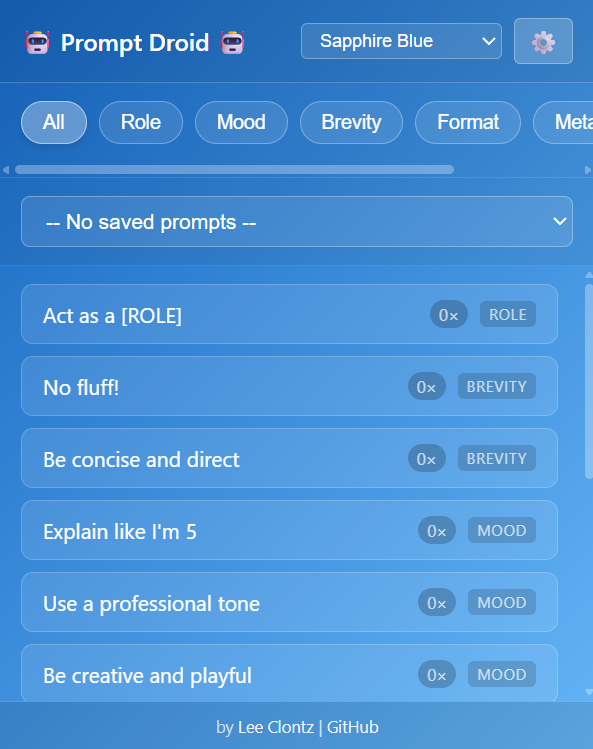

# Prompt Droid

A Chrome or Edge extension that provides quick access to your favorite prompt snippets and templates while working with AI assistants.

## Features

- ✨ **Floating Panel**: A beautiful, draggable floating drawer that stays on top of your content
- 🎯 **Quick Snippets**: One-click access to common prompt patterns like "Act as a [ROLE]" or "No fluff!"
- 🏷️ **Smart Categorization**: Filter snippets by Mood, Role, Brevity, Format, or Meta categories
- 📊 **Usage Tracking**: Snippets automatically sort by most frequently used
- 💾 **Saved Prompts**: Store full-length prompts in a dropdown for easy reuse
- ➕ **Context Menu Integration**: Right-click any text to save it as a snippet or prompt
- ⚙️ **Full Management**: Comprehensive settings page to manage all your snippets and prompts
- 🎨 **Modern Design**: Beautiful gradient UI with smooth animations
- 🔄 **Sync Across Devices**: All your prompts sync via Chrome's storage

## Installation

### From Source (Developer Mode)

1. Download the [zip file](https://github.com/lclontz/prompt-droid/blob/main/prompt-droid.zip) and unpack it
2. Open Chrome or Edge and navigate to `chrome://extensions/`
3. Ensure that the **Developer mode** toggle is enabled
4. Click **Load unpacked**
5. Select the `prompt-droid` folder you unpacked in step 1
6. Select the extensions link on your toolbar and pin `Prompt Droid`
7. The extension icon should appear in your toolbar!

## Usage

### Opening the Drawer

Click the Prompt Droid icon in your Chrome toolbar to toggle the floating drawer.

### Using Snippets

1. Click on any snippet button to insert it at your cursor position
2. If no input field is focused, the snippet will be copied to your clipboard
3. Snippets are automatically sorted by usage count (most used appear first)

### Filtering Snippets

Use the category buttons at the top of the drawer to filter:
- **All**: Show all snippets
- **Mood**: Tone-related snippets (e.g., "Be creative and playful")
- **Role**: Role-playing prompts (e.g., "Act as a technical writer")
- **Brevity**: Conciseness instructions (e.g., "No fluff!")
- **Format**: Output format requests (e.g., "Output as JSON")
- **Meta**: Meta-instructions (e.g., "Show your reasoning step by step")

### Using Saved Prompts

1. Click the "Saved Prompts" dropdown
2. Select any saved prompt to insert it at your cursor
3. The dropdown shows usage counts in parentheses

### Saving Text from Web Pages

1. **Highlight any text** on a web page
2. **Right-click** and choose:
   - **"Save to Prompt Droid (snippet)"** - for short reusable phrases
   - **"Save to Prompt Droid (full prompt)"** - for complete prompts
3. The text will be added to your collection and appear in the drawer

### Managing Your Collection

1. Click the **⚙️ Settings** button at the bottom of the drawer
2. Or right-click the extension icon and select **Options**

In the settings page, you can:
- **Add/Edit/Delete** snippets and prompts
- **Change categories** for snippets
- **Export** your data as a JSON backup
- **Import** previously exported data
- **Reset** to default snippets

## Default Snippets

The extension comes with these useful default snippets:

**Role**:
- Act as a [ROLE]
- Act as a technical writer
- Act as a copywriter

**Brevity**:
- No fluff!
- Be concise and direct

**Mood**:
- Explain like I'm 5
- Use a professional tone
- Be creative and playful

**Format**:
- Output as JSON
- Use markdown formatting

**Meta**:
- Show your reasoning step by step
- Ask clarifying questions first

## Tips & Tricks

1. **Bracket Placeholders**: Use `[ROLE]`, `[TOPIC]`, etc. in your snippets as placeholders you can quickly replace
2. **Frequency Matters**: The drawer learns what you use most and surfaces those snippets first
3. **Quick Access**: Pin the extension icon to your toolbar for fastest access
4. **Context Switching**: The drawer works great for switching between different AI conversation styles
5. **Backup Regularly**: Use the Export feature to backup your customized collection

## Keyboard Shortcuts

Currently, the extension uses the icon click to toggle. You can set up a custom keyboard shortcut:

1. Go to `chrome://extensions/shortcuts`
2. Find "Prompt Drawer"
3. Set your preferred shortcut for "Activate the extension"

## Privacy

- All data is stored locally in Chrome's sync storage
- No data is sent to external servers
- Your prompts sync across your Chrome browsers (if signed in to Chrome)

## Troubleshooting

**Drawer not appearing?**
- Make sure the extension is enabled in `chrome://extensions/`
- Try clicking the icon again
- Refresh the page you're working on

**Text not inserting?**
- Click inside an input field or textarea first
- If insertion fails, the text will be copied to your clipboard automatically

**Snippets not saving?**
- Check Chrome's sync storage isn't full
- Try exporting your data and reimporting

## Known Limitations

**Sites with Content Security Policy restrictions:**
- Some sites (particularly Microsoft properties like copilot.microsoft.com) have strict security policies that prevent browser extensions from injecting content scripts
- On these sites, the extension drawer may not appear when clicking the icon
- This is a security feature of those sites and cannot be bypassed

**Clipboard fallback:**
- On sites with complex input fields (React components, Shadow DOM, etc.), snippets may be copied to clipboard instead of directly inserted
- Simply click in the input field and paste (Ctrl+V/Cmd+V)
- This ensures the extension works everywhere, even on sites with unusual input implementations

## Development

Built with:
- Manifest V3
- Vanilla JavaScript (no frameworks)
- Chrome Storage API
- Modern CSS with gradients and animations

## License

MIT License - feel free to modify and distribute!

## Contributing

Found a bug or have a feature request? Feel free to open an issue or submit a pull request!

---

